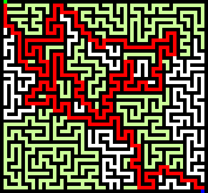

gomez
=====

gomez is a simple library that solves mazes. For now, mazes must conform to a very specific format. They must be gif files that use black (#000000) for walls, green (#00ff00) for the start pixel, and blue (#0000ff) for the end pixel.
An example maze looks like this:

gomez will output a solution that looks like this:

The light green pixels highlight all of the paths that were explored by the algorithm, while the red shows the correct path. Note that these images are ENLARGED TO SHOW TEXTURE. gomez can still solve them, but the red path may look a little funky.

The maze solving algorithm is recursive, and fairly naive. However, it has proved capable of solving even massive (5000x5000) mazes in a reasonable amount of time -- under 2 seconds on my i7. You can try one for yourself [here](http://i.imgur.com/477s1xd.gif).
